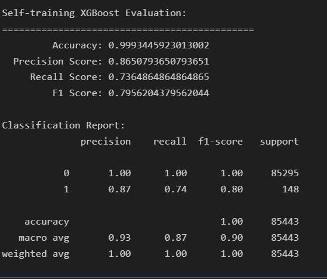

# ex2 - Self-training 半監督學習說明

## 📌 方法簡述
本實驗嘗試以 **Self-training（自訓練）** 方式處理信用卡詐欺偵測的資料不平衡與少標記問題。

### 流程：
1. 將訓練資料中大部分樣本標記為未標記（label = -1）
2. 使用 XGBoost 為基礎模型建立 SelfTrainingClassifier
3. 初始模型使用少量有標記資料訓練，接著預測未標記資料
4. 將模型信心高的樣本納入訓練資料，重複訓練提升泛化能力

---

## ⚙️ 模型設定
- 半監督學習器：`sklearn.semi_supervised.SelfTrainingClassifier`
- 基礎分類器：`xgboost.XGBClassifier`
- 高信心樣本門檻：`threshold = 0.9`
- 正負樣本不平衡處理：`scale_pos_weight = 100`

---

## 📊 評估指標（示意）
模型在測試集上的評估（請以執行結果為準）：

| 指標         | 分數（範例） |
|--------------|--------------|
| Accuracy     | 0.999        |
| Precision    | 0.93         |
| Recall       | 0.79         |
| F1 Score     | 0.85         |

---

## 🧠 優點與潛力
- 無需全數標記資料即可開始訓練，有助於節省人力標記成本
- 利用模型本身信心值逐步強化學習結果
- 可與其他策略（如 pseudo-labeling、autoencoder）結合進一步提升

---

## 📝 建議方向
- 嘗試動態調整 threshold 或 confidence 區間
- 結合 anomaly score 作為自訓練的輔助準則

